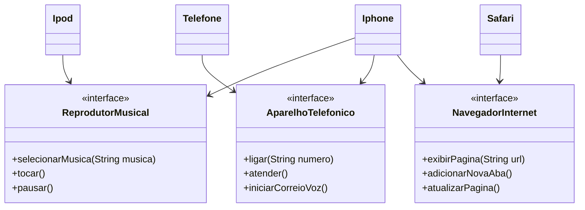

# Desafio Iphone
Projeto para implementar uma estrutura de classes e interfaces que mostrem a novidade do Iphone quando lançado. Toda a implementação é feita de acordo com o  seguinte diagrama de classes:

